# T23 MotorIST Project Read Me

## Team

| Number  | Name             | User                                   | E-mail                                     |
|---------|------------------|----------------------------------------|--------------------------------------------|
| 112167  | Miguel Raposo    | <https://github.com/MiguelRaposo49456> | <miguel.s.raposo@tecnico.ulisboa.pt>       |
| 99132   | Vasco Silva      | <https://github.com/VascoMS>           | <vasco.magalhaes.silva@tecnico.ulisboa.pt> |
| 112192  | Diogo Rodrigues  | <https://github.com/DiogoAMRodrigues>  | <diogo.m.rodrigues@tecnico.ulisboa.pt>     |


  

## Contents

This repository contains documentation and source code for the *Network and Computer Security (SIRS)* project.

The [REPORT](REPORT.pdf) document provides a detailed overview of the key technical decisions and various components of the implemented project.
It offers insights into the rationale behind these choices, the project's architecture, and the impact of these decisions on the overall functionality and performance of the system.

This document presents installation and demonstration instructions.

## Installation

To see the project in action, it is necessary to setup a virtual environment, with 4 networks and 6 machines.  

The following diagram shows the networks and machines:

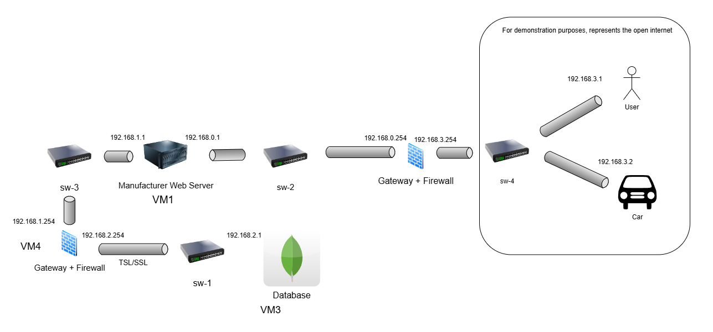

### Prerequisites

All the virtual machines are based on: Linux 64-bit, Kali 2024.3  

[Download](https://cdimage.kali.org/kali-2024.3/kali-linux-2024.3-installer-amd64.iso) and [install](https://github.com/tecnico-sec/Setup/blob/master/KaliSetup.md) a virtual machine of Kali Linux 2024.3.  
Clone the base machine to create the other machines.

### Machine configurations

For each machine, there is an initialization script with the machine name and with suffix `withWifi.sh` or `noWifi.sh`, that installs all the necessary packages and makes all required configurations in the a clean machine.

Inside each machine, use Git to obtain a copy of all the scripts and code.

```sh
$ git clone https://github.com/tecnico-sec/T23
```

Next we have custom instructions for each machine.


#### Order to setup and execute VMs:
VM4 -> VM3 -> VM1 -> VM2 -> VM5 -> VM6

For every VM that you create, you have to setup the adapters as described in their respective sections, but you also need to add one more adapter with NAT.
When you enter the machine, you will have to run the script that has the *setup* prefix of the respective VM.
Following this you will have to close the VM again, remove the adapter that has the NAT and open the VM again.
After that, run the remaining commands in the section of the respective VMs.

#### Machine 1

This machine runs the ManufacturerServer (Springboot and Maven)

Adapters to setup in the VM:
- Adapter 1: Internal Network with name "sw-2", Allow VMs
- Adapter 2: Internal Network with name "sw-3", Allow VMs

Drag the [ManufacturerWebserver](scripts/ManufacturerWebserver.sh) and Drag the [ManufacturerWebserver_setup](scripts/ManufacturerWebserver_setup.sh) files into the VM.

Run this command, when you still have the NAT active, in the Terminal of the VM, on the location you have saved the files to.
```sh
$ ./ManufacturerWebserver_setup.sh
```
After it is done, restart the DB and remove the NAT as described beforehand.

When inside the IDE go into the ManufacturerWebServer directory in the console and run this command.
```sh
$ mvn clean package
```

Move the "ManufacturerWebServer-0.0.1-SNAPSHOT.jar" file into the VM onto the Desktop and open a Terminal in the Desktop.
Following this, run this command:
```sh
$ ./ManufacturerWebserver.sh
```

The expected results are for the webserver to be running

If you get an exception or it crashed, you probably did not follow the correct order of VMs to run. 
The database VM and internal gateway VM have to be started before this VM can run properly.
To see if this VM is running correctly you can run the test in the internal gateway VM (VM4), that i have explained in the respective section.

#### Machine 2

This machine runs the External Gateway

Adapters to setup in the VM:
- Adapter 1: Internal Network with name "clientCarAdapter", Allow VMs
- Adapter 2: Internal Network with name "sw-2", Allow VMs

Drag the [gatewayExternal](scripts/gatewayExternal.sh) file into the VM.

Run this command, when you still have the NAT active.
```sh
$ ./gatewayExternal.sh
```
After it is done, restart the DB and remove the NAT as described beforehand.

To test run this comand in the Terminal:
```sh
$ sudo tcpdump -i eth0 port 443
```
The expected results are for you to see the traffic moving, when running operations in the ClientCLI or CarServer (They have to be setup for you to be able to test this)

```sh
$ sudo iptables -L
$ ip route
```
This is what is supposed to show up for iptables:
```sh
192.168.0.0/24 dev eth1 proto kernel scope link src 192.168.0.254 
192.168.3.0/24 dev eth0 proto kernel scope link src 192.168.3.254 
```
This is what is supposed to show up for ip route:
```sh
Chain INPUT (policy DROP)
target     prot opt source               destination         

Chain FORWARD (policy DROP)
target     prot opt source               destination         
ACCEPT     tcp  --  anywhere             anywhere             state RELATED,ESTABLISHED
ACCEPT     tcp  --  anywhere             192.168.0.1          tcp dpt:https
ACCEPT     tcp  --  anywhere             192.168.0.1          tcp dpt:snpp
DROP       all  --  anywhere             anywhere            

Chain OUTPUT (policy DROP)
target     prot opt source               destination     
```

#### Machine 3

This machine runs the Database(Mongo 4.4)

Adapters to setup in the VM:
- Adapter 1: Internal Network with name "sw-1", Allow VMs

Drag the [database](scripts/database.sh) file and the DBFiles into the VM.

Run this command, when you still have the NAT active.
```sh
$ ./database.sh
```
After it is done, restart the DB and remove the NAT as described beforehand.
Following this, run these commands in the Terminal one by one:
```sh
$ sudo docker run -it --name mongodb -v $(pwd)/DBFiles:/data/db -p 27017:27017 mongo:4.4 bash
$ cd data/db/DBFiles
$ mongod --config mongo.conf
```

The expected results are that the Docker container is up and running the mongod instance.


#### Machine 4

This machine runs the Internal Gateway

Adapters to setup in the VM:
- Adapter 1: Internal Network with name "sw-3", Allow VMs
- Adapter 2: Internal Network with name "sw-1", Allow VMs

Drag the [gatewayInternal](scripts/gatewayInternal.sh) file into the VM.

Run this command, when you still have the NAT active.
```sh
$ ./gatewayInternal.sh
```
After it is done, restart the DB and remove the NAT as described beforehand.

To test run this comand in the Terminal:
```sh
$ sudo tcpdump -i eth0 port 27017
```
The expected results are for you to see the traffic moving, when the Database and ManufacturerWebServer are running. (They have to be setup for you to be able to test this)

```sh
$ sudo iptables -L
$ ip route
```
This is what is supposed to show up for iptables:
```sh
192.168.1.0/24 dev eth0 proto kernel scope link src 192.168.1.254 
192.168.2.0/24 dev eth1 proto kernel scope link src 192.168.2.254 
```
This is what is supposed to show up for ip route:
```sh
Chain INPUT (policy DROP)
target     prot opt source               destination         

Chain FORWARD (policy DROP)
target     prot opt source               destination         
ACCEPT     tcp  --  192.168.1.1          192.168.2.1          tcp dpt:27017 state NEW
ACCEPT     tcp  --  192.168.2.1          192.168.1.1          tcp spt:27017 state NEW
ACCEPT     all  --  anywhere             anywhere             state RELATED,ESTABLISHED

Chain OUTPUT (policy DROP)
target     prot opt source               destination   
```

#### Machine 5

This machine runs the Car(Springboot, Maven and SQLite)

Adapters to setup in the VM:
- Adapter 1: Internal Network with name "clientCarAdapter", Allow VMs

Drag the [car](scripts/car.sh) and Drag the [car_setup](scripts/car_setup.sh) files into the VM.

Run this command, when you still have the NAT active, in the Terminal of the VM, on the location you have saved the files to.
```sh
$ ./car_setup.sh
```
After it is done, restart the DB and remove the NAT as described beforehand.

When inside the IDE go into the CarServer directory in the console and run this command.
```sh
$ mvn clean package
```

Move the "CarServer.jar" file into the VM onto the Desktop and open a Terminal in the Desktop. (It has to be called CarServer.jar)
Following this, run this command:
```sh
$ ./car.sh
```

The expected results are for the car to be running 

#### Machine 6

This machine runs the Client/Mechanic(Maven)

Adapters to setup in the VM:
- Adapter 1: Internal Network with name "clientCarAdapter", Allow VMs

 Drag the [userCLI](scripts/userCLI.sh) file into the VM.

Run this command, when you still have the NAT active, in the Terminal of the VM, on the location you have saved the files to.
```sh
$ ./userCLI.sh
```
After it is done, restart the DB and remove the NAT as described beforehand.

When inside the IDE go into the ClientCLI directory in the console and run this command.
```sh
$ mvn clean package
```

Move the "ClientCLI.jar" file into the VM onto the Desktop and open a Terminal in the Desktop.
Following this, run this command:
```sh
$ java -jar CLientCLI.jar
```

The expected results are for the Client to be running 


## Demonstration

Now that all the networks and machines are up and running, you should have the Car and ClientCLI open and displaying possible commands.

```sh
Choose a command: 
1. Pair a car
2. Get a configuration
3. Update a configuration
4. Delete a configuration
5. Get general car information
6. Change car
7. Logout
```
Registering new user:  
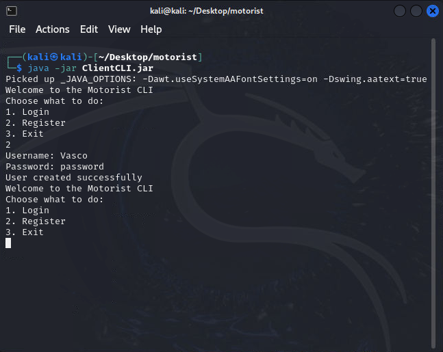  
Initiating pairing session between user and car:  
CarCLI  
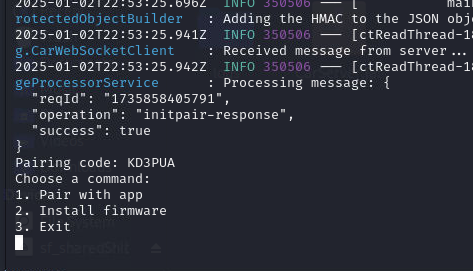  
UserCLI  
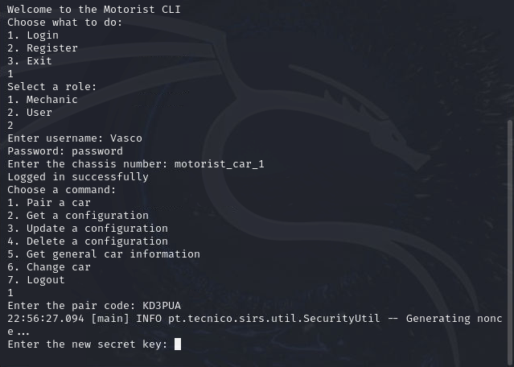  
Storing displayed secret key:  
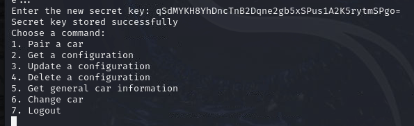  
Updating the user configuration:  
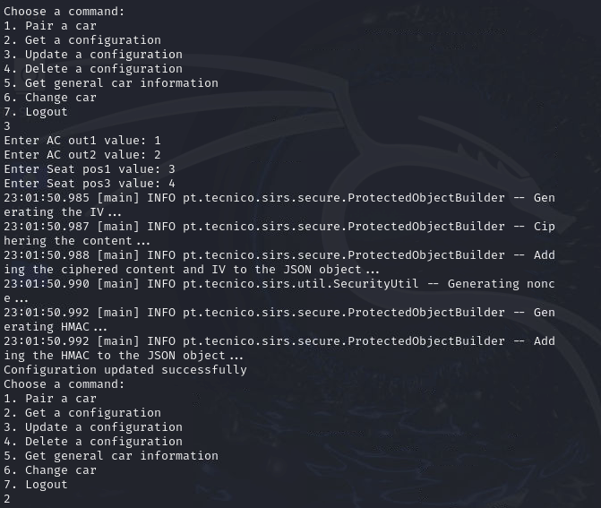  
Configuration content is encrypted between the user and car:  
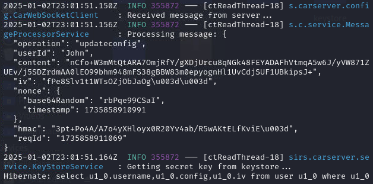  
Get the new updated configuration:  
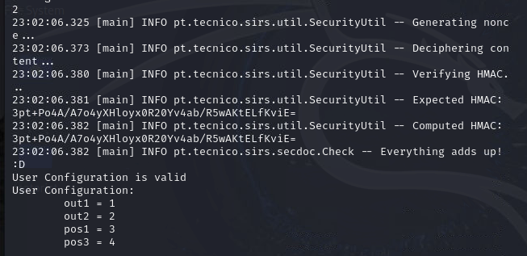  
Get general information about the car:  
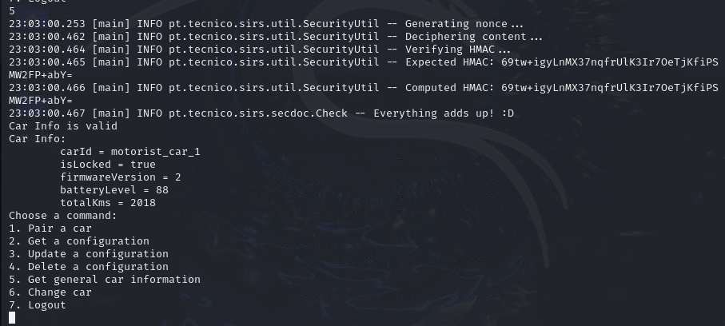  

Logging in with the Mechanic and downloading the firmware that is signed by the Manufacturer:  
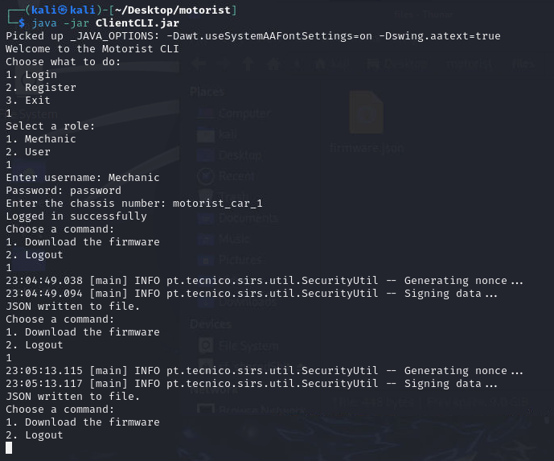  
Installing the obtained firmware on the Car:  
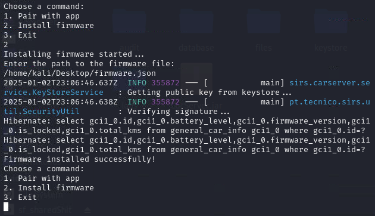  

Installing firmware that was tampered with. This firmware was signed by the Manufacturer, for version 2 and was altered to version 8.6:  
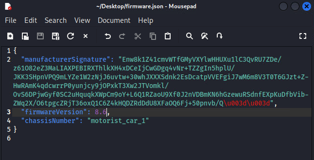  
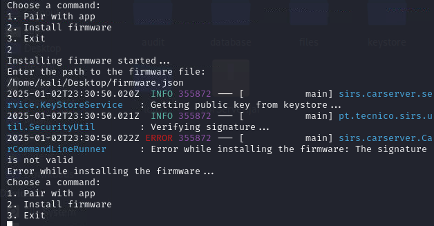  

If we use a packet sniffer like wireshark all data in transit is encrypted by the TLS protocol:  
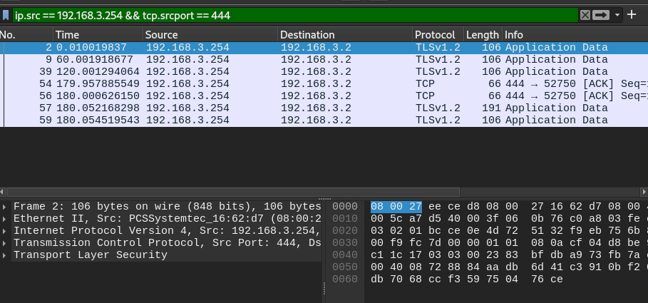  
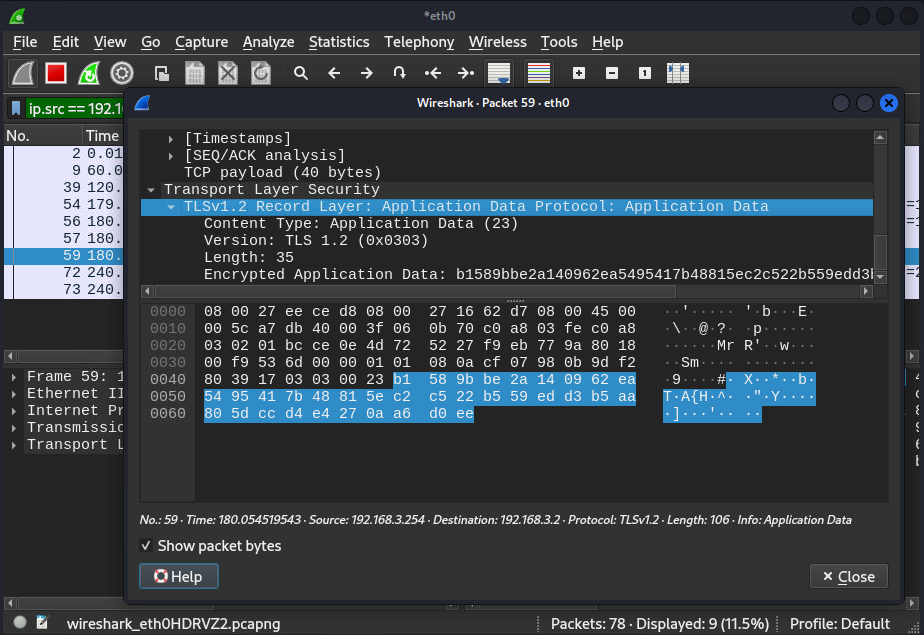  

----
END OF README
